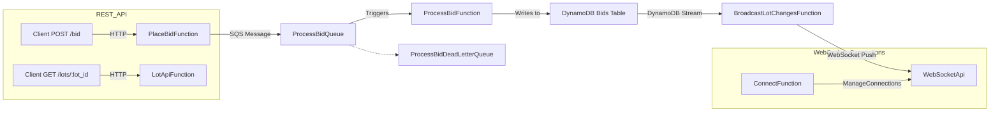

# SamSold Bidding System – Serverless Architecture

This project defines the **SamSold Bidding System**, a serverless auction backend built using the **AWS Serverless Application Model (AWS SAM)**.  
It implements core auction workflows—placing bids, managing lots, and broadcasting updates to connected clients—through an event-driven, scalable architecture leveraging **AWS Lambda**, **Amazon API Gateway**, **Amazon SQS**, and **Amazon DynamoDB**.

---

## Table of Contents
- [Architecture Overview](#architecture-overview)
- [Core Components](#core-components)
  - [1. PlaceBidFunction](#1-placebidfunction)
  - [2. ProcessBidFunction](#2-processbidfunction)
  - [3. LotApiFunction](#3-lotapifunction)
  - [4. BroadcastLotChangesFunction](#4-broadcastlotchangesfunction)
  - [5. WebSocket Components](#5-websocket-components)
  - [6. Shared Layer](#6-shared-layer)
- [Architecture Diagram](#architecture-diagram)
- [Data Flow](#data-flow)
- [Queues and Dead-Letter Handling](#queues-and-dead-letter-handling)
- [Logging and Monitoring](#logging-and-monitoring)
- [Deployment](#deployment)
- [Outputs](#outputs)

---

## Architecture Overview

The system follows a **modular, event-driven architecture**:

- **REST API** receives client requests for bidding and lot info.
- **Lambda functions** handle business logic: placing bids, processing bids, and broadcasting lot updates.
- **SQS FIFO queue** ensures ordered processing of bids.
- **DynamoDB** stores bid and connection data.
- **WebSocket API** streams real-time updates to connected clients.

---

## Core Components

### 1. PlaceBidFunction
**Purpose:**  
Handles HTTP `POST /bid` requests from clients to place a bid.

**Key Features:**
- Triggered by **API Gateway REST endpoint** (`/bid`).
- Publishes a message to the **ProcessBidQueue (SQS FIFO)**.
- Environment variable: `BID_QUEUE_URL` for message destination.

**Policies:**
- `sqs:SendMessage` permission to the SQS queue.

---

### 2. ProcessBidFunction
**Purpose:**  
Processes bids asynchronously from the SQS queue.

**Key Features:**
- Triggered by **SQS messages** from `ProcessBidQueue`.
- Writes bid data to the **DynamoDB Bids Table**.
- Implements **ReservedConcurrentExecutions = 1** to ensure sequential bid processing.
- Supports **dead-letter queue (DLQ)** for failed messages.

**Policies:**
- `SQSPollerPolicy`, `SQSSendMessagePolicy` for DLQ communication.
- `DynamoDBCrudPolicy` for table operations.

---

### 3. LotApiFunction
**Purpose:**  
Provides the RESTful `GET /lots/{lot_id}` endpoint for lot information.

**Key Features:**
- Triggered by **API Gateway REST endpoint**.
- Reads from the **DynamoDB Bids Table**.
- Supports standard CRUD via the `DynamoDBCrudPolicy`.

**Environment Variables:**
- `BIDS_TABLE`: References `SamSold-BidsTable`.

---

### 4. BroadcastLotChangesFunction
**Purpose:**  
Pushes **real-time lot updates** to connected clients via WebSockets.

**Key Features:**
- Triggered by **DynamoDB Streams** on `SamSold-BidsTable`.
- Filters `MODIFY` events for records whose partition key starts with `LOT#`.
- Uses `execute-api:ManageConnections` to send messages to WebSocket clients.

**Environment Variables:**
- `CONNECTIONS_TABLE`
- `WEBSOCKET_API_INVOKE_URL`

---

### 5. WebSocket Components
**Purpose:**  
Manages bid notification connections and broadcasts.

**Components:**
- **WebSocketApi** – API Gateway WebSocket API endpoint (`wss://.../dev`)
- **ConnectFunction** – Handles `$connect` and `$disconnect` routes.
- **ConnectionsTable (imported)** – Tracks connected client sessions.
- **Integrations and Routes** – Allow bid updates to be pushed to clients.

**Permissions:**
- Allows `execute-api:ManageConnections` and `DynamoDBCrudPolicy`.

---

### 6. Shared Layer – `SamSoldLayer`
**Purpose:**  
Provides shared Python dependencies for all Lambda functions.

**Key Features:**
- Compatible with Python 3.12.
- Reduces deployment size and improves cold-start performance.

---

## Architecture Diagram



## Data Flow

1. **Client places a bid** → API Gateway → `PlaceBidFunction`.
2. `PlaceBidFunction` publishes to `ProcessBidQueue`.
3. `ProcessBidFunction` consumes messages, validates bids, and updates DynamoDB.
4. DynamoDB emits a stream event for modified `LOT#` records.
5. `BroadcastLotChangesFunction` consumes the stream and pushes updates to WebSocket connections.
6. Connected WebSocket clients receive **real-time bid updates**.

---

## Queues and Dead-Letter Handling

| Queue Name                  | Type | Purpose                                         |
|------------------------------|------|------------------------------------------------|
| `ProcessBidQueue`            | FIFO | Ensures ordered bid processing per lot        |
| `ProcessBidDeadLetterQueue`  | FIFO | Captures failed bid events after 3 attempts   |

---

## Logging and Monitoring

Each Lambda function has a dedicated **CloudWatch Log Group** with **1-day retention:

- `/aws/lambda/PlaceBidFunction`
- `/aws/lambda/ProcessBidFunction`
- `/aws/lambda/LotApiFunction`
- `/aws/lambda/BroadcastLotChangesFunction`
- `/aws/lambda/ConnectFunction`

---

## Deployment

### Prerequisites

- AWS SAM CLI
- AWS account with permissions for Lambda, API Gateway, DynamoDB, and SQS
- Python 3.12 environment

### Commands

```bash
sam build
sam deploy --guided
```
## Outputs

| Output                   | Description                                           |
|---------------------------|-------------------------------------------------------|
| **BidsApiEndpoint**       | REST API endpoint for placing and retrieving bids    |
| **WebSocketApiEndpoint**  | WebSocket endpoint for real-time bid notifications  |

**Example:**

```bash
BidsApiEndpoint: https://abc123.execute-api.us-east-1.amazonaws.com/
WebSocketApiEndpoint: wss://xyz456.execute-api.us-east-1.amazonaws.com/dev
```
## Summary

This SAM template defines a **scalable, event-driven auction system**:

- **Synchronous bid submission** via REST API
- **Asynchronous bid processing** via SQS and Lambda
- **Real-time updates** over WebSockets
- **Serverless-first design** ensuring minimal operations overhead, pay-per-use efficiency, and modular evolution
